<a href="https://yamadablog.github.io/YamadaBlog/">
  <picture>
    <source media="(prefers-color-scheme: dark)" srcset="./assets/header-dark.svg">
    
  </picture>
</a>

<p align="center"><samp>
  <a href="https://yamadablog.github.io/YamadaBlog/">site</a> .
  <a href="#work">work</a> .
  <a href="#instruments">instruments</a> .
  <a href="#lab-notebook">notebook</a> .
  <a href="#invariants">invariants</a> .
  <a href="https://github.com/YamadaBlog/pulse-player">pulse-player</a> .
  <a href="https://www.youtube.com/@YamadaBlog">youtube</a>
</samp></p>

I build systems that have to be **right**, not just run: research platforms where one look-ahead bug silently
invalidates months of results, a UI component that must behave identically in six frameworks, and AI tooling
that remembers what it did yesterday. Most of it is private. This page is the public index.

<!-- telemetry -->
<samp>calibrated 2026-09-26 . 3,770 contributions . 236 active days . longest streak 32d . load avg 17.14 / 27.70 / 18.18</samp>
<!-- /telemetry -->

<br>

### work

```text
~/work
├── pulse-player/          public   7 npm packages, 6 frameworks, one core
├── quant-platform/        private  ~2k commits . data -> features -> RL agents -> replay -> execution
├── asof/                  private  static linter for temporal leakage, bitemporal store, sealed datasets
├── proof-of-fill/         private  execution integrity: signed slippage vs an independent reference
├── anima/                 private  embodied AI desktop companion (Tauri/Rust + TS)
└── personal-os/           private  estate map, ADRs, agent memory -- the spine of everything above
```

**[pulse-player](https://github.com/YamadaBlog/pulse-player)** — a drop-in music player shipped as seven `@pulse-music/*` packages:
one framework-agnostic core, thin wrappers for Vue, React, Svelte, Angular, Web Components and React Native.
The part I care about is the release engineering: npm provenance (sigstore-attested, built in CI),
the Vue reference checked byte-for-byte in CI, clean-consumer installs tested end to end,
and a post-deploy smoke job on the [live demo](https://yamadablog.github.io/pulse-player/) that fails on a single console error.

**quant-platform** — a year of work, ~2,000 commits. Cross-validated data ingestion, feature pipelines,
multi-instrument reinforcement-learning agents, a model factory (*train → select → replay → qualify*),
broker execution, monitoring, manual promotion gates and a disaster-recovery mirror.
Backtest, replay and live all call the same `process_bar()`, so they cannot diverge — it is not a test, it is the architecture.

**asof** and **proof-of-fill** are what fell out of that work: tools that make *"this result is real"* a checkable claim
rather than a feeling.

<sub>Private work is described in general terms on purpose. Architecture and code walkthroughs on request.</sub>

<br>

### instruments

<picture>
  <source media="(prefers-color-scheme: dark)" srcset="./assets/seismo-dark.svg">
  
</picture>

<picture>
  <source media="(prefers-color-scheme: dark)" srcset="./assets/spectrum-dark.svg">
  
</picture>

<sub>No hosted stat cards. Every graphic above is rendered from the GitHub API by <a href="./scripts/forge.py"><code>scripts/forge.py</code></a> (stdlib Python) and re-forged nightly by a workflow.</sub>

<br>

### lab notebook

Most experiments end in a written *no*. That is the lab working.

```diff
- trailing / dynamic exits          cut exactly the tail winners that paid for everything
- mean-reversion on thin edge       real at zero cost, dead after realistic spreads
- a "great" backtest                indicator compared against the wrong-timeframe ATR. now a checklist item
+ entry at next-bar open            edge survived moving off the signal bar's close
+ rolling walk-forward + FDR        kept only what survived multiple-testing correction
+ replay engine                     backtest == live, proven: incremental run == batch run
! temporal-leakage linter           running. catch look-ahead before it reaches a backtest
```

<br>

### invariants

```python
assert result.data_seen_at <= decision.time          # no look-ahead, ever
assert backtest.process_bar is live.process_bar      # one code path, not two that "should match"
assert out_of_sample.opened == 1                     # the test set is read once, then it is spent
assert sha256(dataset) == manifest[dataset.name]     # results point at the exact bytes that made them
assert "no edge" in notebook                         # killing ideas is output, not waste
```

<br>

### stack

<samp>
python . typescript . rust (tauri) . bash / pwsh<br>
pandas . numpy . reinforcement learning (ppo) . walk-forward . bootstrap . fdr<br>
vue 3 . react . svelte . angular . lit / web components . react native<br>
docker . github actions . gitlab ci . kind . keycloak . npm provenance<br>
pytest . vitest . playwright (a11y) . determinism tests . size budgets
</samp>

<br>

### reach

```sh
curl -sL yamadablog.github.io/YamadaBlog/card.txt
```

<sub><samp>this README is re-forged every night. the snake in the header is drawn with the source of the program that draws it.</samp></sub>
