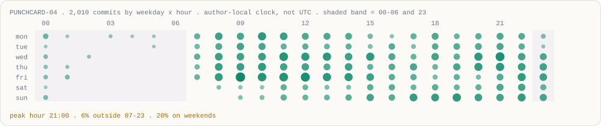
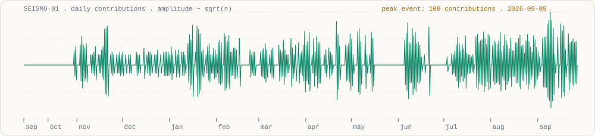

<div align="center">

<a href="https://yamadablog.github.io/YamadaBlog/">
  <picture>
    <source media="(prefers-color-scheme: dark)" srcset="./assets/banner-dark.svg">
    
  </picture>
</a>

<samp>
<b>site</b> <a href="https://yamadablog.github.io/YamadaBlog/">yamadablog.github.io</a> &nbsp;·&nbsp;
<b>oss</b> <a href="https://github.com/YamadaBlog/pulse-player">pulse-player</a> &nbsp;·&nbsp;
<b>shell</b> <code>curl -sL yamadablog.github.io/YamadaBlog/card.txt</code>
</samp>

</div>

```console
$ whoami
mao — I build systems that have to be right, not just run.
$ cat /etc/motd
things that break silently are the only things worth engineering against.
$ ls ~ | wc -l          # public index of a mostly private bench
6
```

<!-- telemetry -->
<samp>calibrated 2026-09-26 . 3,790 contributions . 237 active days . longest streak 32d . load avg 20.00 / 28.37 / 18.40</samp>
<!-- /telemetry -->

---

### `/bench`

```text
┌─ rack ───────────────────────────────────────────────────────────────────────┐
│ SLOT 01  research infra   no look-ahead · sealed test sets · replayable      │
│ SLOT 02  orchestration    durable state · idempotent · budget-gated · HITL   │
│ SLOT 03  reverse eng.     obfuscated binaries · packed runtimes · protocols  │
│ SLOT 04  security         authorized only · scope first · private reporting  │
│ SLOT 05  systems          survives crash, reboot, and its own bugs           │
│ SLOT 06  applied ML       RL under non-stationarity · drift as a safety net  │
│ SLOT 07  frontend         one core, six frameworks, identical behaviour      │
└──────────────────────────────────────────────────────────────────────────────┘
        pull a drawer ↓ for what each actually means
```

<details>
<summary><samp><b>SLOT 03 · reverse engineering</b> — reading things that do not want to be read</samp></summary>

<br>

```text
surface        obfuscated & virtualized managed binaries · packed interpreters
               network protocol + serialization layers · update / licensing paths
approach       static first. dynamic only in an isolated lab. never on a live host.
discipline     no execution oracle  ->  documented as blocked, not guessed
artifact       ~32k lines reconstructed from a protected binary · 277 commits / 2 weeks
```

A protector's bytecode VM got partially mapped — dispatcher, opcode tables, fetch mechanics —
then hit a wall without an execution oracle. That wall is written down as a wall.
Retracting a wrong conclusion in the notes is the job; guessing is not.

</details>

<details>
<summary><samp><b>SLOT 04 · security research</b> — authorized assessment only</samp></summary>

<br>

```text
gate           written authorization + defined scope + rules of engagement
               any one missing  ->  engagement suspended. no exceptions.
method         PTES · OWASP WSTG / ASVS · CVSS v3.1 · timestamped evidence chain
surface        web/API posture · transport & header hardening · cross-origin policy
               auth-flow logic · update-channel & code-signing integrity · supply chain
output         findings register · executive report · prioritized remediation plan
               scope limits documented rather than papered over
```

Targets, findings, evidence and tooling stay private. Permanently.
Nothing operational is published here, and nothing ever will be.

</details>

<details>
<summary><samp><b>SLOT 02 · agent orchestration</b> — a private control plane, ~700 commits</samp></summary>

<br>

```text
queue          transactional · atomic claim · idempotent enqueue
               bounded retry -> dead-letter, never an infinite loop
routing        policy-driven across providers · primary/fallback cascades
               degraded provider -> quarantined automatically
money          budget ceiling checked BEFORE a billable call, not after
               deterministic effect key: never re-issue a call whose outcome is unknown
journal        append-only, hash-chained · checkpoint + replay recovery
autonomy       fail-safe by default:
                   transition whitelisted and within budget  ->  continue
                   anything else                             ->  stop, ask a human
```

Scheduled and resumable. Deliberately operated attended — unattended mode is built
but gated, because I have not yet earned the right to walk away from it.

</details>

<details>
<summary><samp><b>SLOT 01 · research infrastructure</b> — ~1k commits, 9 months</samp></summary>

<br>

```text
pipeline       ingest -> cross-validate -> features -> RL agents
               -> replay -> qualify -> gate -> execute -> monitor
core rule      backtest, replay and live call the same process_bar()
               divergence is impossible by construction, not merely unlikely
stats          walk-forward · frozen out-of-sample · FDR correction · cost stress
safety         drift and out-of-distribution kill-switches
compute        local-GPU-first, burst to cloud when the queue justifies it
```

</details>

<details>
<summary><samp><b>SLOT 05 · systems &amp; automation</b> — the boring parts that save you</samp></summary>

<br>

```text
canary gate    a git pre-commit hook blocks any commit that regresses a known fact.
               a deterministic gate is the only kind an agent cannot talk past.
memory         markdown is truth, the index is cache. burn the index, lose nothing.
               bitemporal facts: what was true, and when I knew it.
ADRs           append-only. every claim tagged proven / logical / hypothesis / rejected.
               rejections kept WITH the evidence that killed them.
durability     atomic writes (tmp -> fsync -> replace) · offsite continuity
               restore drills that actually run
honesty        SLO reporting returns `unavailable` rather than inventing
               a metric out of zero observations
```

</details>

<details>
<summary><samp><b>SLOT 07 · frontend</b> — <a href="https://github.com/YamadaBlog/pulse-player">pulse-player</a>, public, on npm</samp></summary>

<br>

One drop-in music player, seven `@pulse-music/*` packages, six frameworks — Vue, React, Svelte,
Angular, Web Components, React Native — from a single framework-agnostic core.

```text
provenance     sigstore-attested, built in CI
parity         Vue reference checked byte-for-byte in CI
consumers      clean-install builds tested end to end
demo           post-deploy smoke job fails on ONE console error
```

<a href="https://yamadablog.github.io/pulse-player/">live demo</a> · <a href="https://youtu.be/q_FJ1GWaCc8">3-min video</a>

</details>

---

### `/telemetry`

<picture>
  <source media="(prefers-color-scheme: dark)" srcset="./assets/punch-dark.svg">
  
</picture>

<picture>
  <source media="(prefers-color-scheme: dark)" srcset="./assets/seismo-dark.svg">
  
</picture>

<details>
<summary><samp><b>emission spectrum</b> — what the source is actually made of</samp></summary>

<br>

<picture>
  <source media="(prefers-color-scheme: dark)" srcset="./assets/spectrum-dark.svg">
  
</picture>

</details>

---

### `/automaton`

<picture>
  <source media="(prefers-color-scheme: dark)" srcset="./assets/life-dark.svg">
  
</picture>

<sub>Life, B3/S23, seeded by the year itself: a cell is born wherever that day beat the median.
The colonies are the busy weeks. Generations are pre-computed and cross-faded in SMIL,
because a README cannot run JavaScript.</sub>

---

### `/instruments`

```text
bench          win11 + wsl2 · agent cli + mcp + hooks + subagents · tmux · ripgrep · just
languages      python 3.12 · typescript · rust (tauri) · c# (reading) · lua · bash · pwsh
data           pandas · numpy · duckdb · parquet · sqlite (wal, fts5) · polars
ml             pytorch · ppo/rl · mlflow · multi-seed consensus · walk-forward · bootstrap
orchestration  docker compose · temporal · task queues · scheduled ticks · dstack · cloud gpu
models         multi-provider routing · cost ledgers · json-contract validation · evals
ui             vue 3 · react · svelte · angular · lit · react native · vite
observability  prometheus · grafana · sli/slo + error budgets · watchdogs · alerting
delivery       github actions · gitlab ci · canary deploys · semgrep · gitleaks · locked deps
verification   pytest · hypothesis · vitest · playwright (a11y) · golden traces · replay
analysis       decompilers · disassemblers · protocol analysis · instrumentation · proxies
```

---

### `/experiments`

<samp>most of them end in a written <b>no</b>. that is the lab working, not failing.</samp>

```diff
- trailing / dynamic exits        cut exactly the tail winners that paid for everything
- mean-reversion on a thin edge   real at zero cost, dead after realistic spreads
- vector DBs, graph RAG, three    markdown + a rebuildable index outlived all of them
  agent-memory frameworks
- a "great" backtest              wrong-timeframe volatility. now a checklist item
+ entry at next-bar open          edge survived moving off the signal bar's close
+ walk-forward + FDR              kept only what survived multiple-testing correction
+ replay engine                   backtest == live. proven: incremental run == batch run
+ idempotent effect keys          a crashed worker can no longer double-charge a provider
! temporal-leakage linter         running — catch look-ahead before it reaches a backtest
! protected-binary devirt         mapped, then blocked. documented as blocked.
```

---

### `/invariants`

```python
assert result.data_seen_at <= decision.time        # no look-ahead, ever
assert backtest.process_bar is live.process_bar    # one code path, not two that "should match"
assert out_of_sample.opened == 1                   # read once, then it is spent
assert sha256(dataset) == manifest[dataset.name]   # results point at the bytes that made them
assert transition in contract or requires_human()  # anything unlisted stops and asks
assert effect_key not in ledger or not retried     # never pay twice for an unknown outcome
assert scope.authorized and scope.written          # no target without a signed scope
assert "no edge" in notebook                       # killing ideas is output, not waste
```

---

<div align="center">

<picture>
  <source media="(prefers-color-scheme: dark)" srcset="./assets/sigil-dark.svg">
  
</picture>

<samp>every graphic above is rendered from the GitHub API by <a href="./scripts/forge.py"><code>scripts/forge.py</code></a><br>
stdlib python, no dependencies, no hosted widgets · re-forged nightly<br>
press <code>~</code> on the <a href="https://yamadablog.github.io/YamadaBlog/">site</a> for a shell</samp>

</div>
