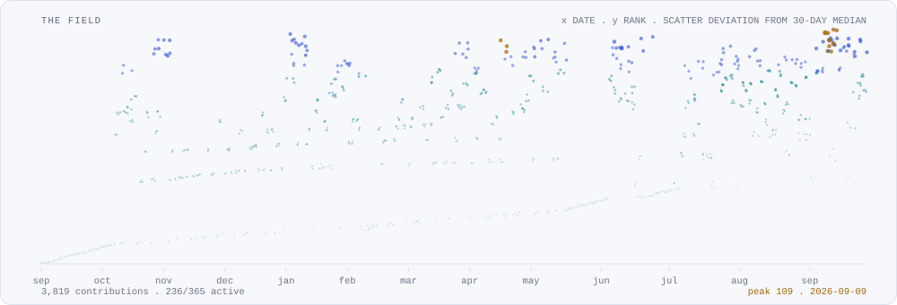
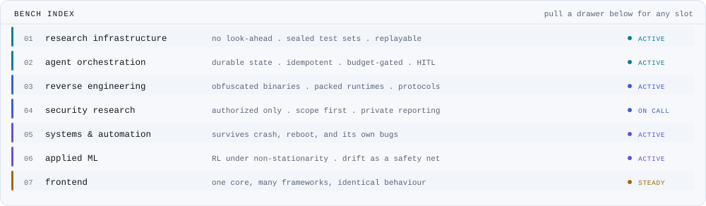
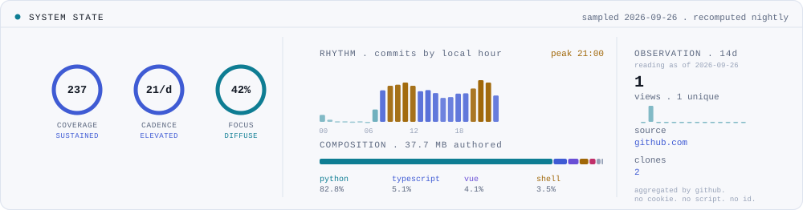

<div align="center">

<a href="https://yamadablog.github.io/YamadaBlog/">
  <picture>
    <source media="(prefers-color-scheme: dark)" srcset="./assets/banner-dark.svg">
    
  </picture>
</a>

<samp>
<b>site</b> <a href="https://yamadablog.github.io/YamadaBlog/">yamadablog.github.io</a> &nbsp;·&nbsp;
<b>shell</b> <code>curl -sL yamadablog.github.io/YamadaBlog/card.txt</code>
</samp>

</div>

I build systems that have to be **right**, not just run.
Most of the bench is private — this is the public index.

<a href="https://yamadablog.github.io/YamadaBlog/">
  <picture>
    <source media="(prefers-color-scheme: dark)" srcset="./assets/field-dark.svg">
    
  </picture>
</a>

<sub><b>THE FIELD</b> — one mark per day. x is the date, y is that day's rank among the year,
and the scatter is its deviation from the surrounding 30-day median. The portfolio animates
the same mapping in WebGL: <a href="https://yamadablog.github.io/YamadaBlog/">yamadablog.github.io</a>.</sub>

<picture>
  <source media="(prefers-color-scheme: dark)" srcset="./assets/session-dark.svg">
  
</picture>

<!-- telemetry -->
<samp>sampled 2026-09-26 . 3,820 contributions . 237/365 active . streak 32d . cadence 24.3/d . 1 views / 1 unique inbound</samp>
<!-- /telemetry -->

---

### `/bench`

<picture>
  <source media="(prefers-color-scheme: dark)" srcset="./assets/bench-dark.svg">
  
</picture>

<details>
<summary><samp><b>SLOT 03 · reverse engineering</b> — reading things that do not want to be read</samp></summary>

<br>

```text
surface        obfuscated & virtualized managed binaries · packed interpreters
               network protocol + serialization layers · update / licensing paths
approach       static first. dynamic only in an isolated lab. never on a live host.
discipline     no execution oracle  ->  documented as blocked, not guessed
artifact       ~32k lines reconstructed from a protected binary · 277 commits / 2 weeks
```

A protector's bytecode VM got partially mapped — dispatcher, opcode tables, fetch mechanics —
then hit a wall without an execution oracle. That wall is written down as a wall.
Retracting a wrong conclusion in the notes is the job; guessing is not.

</details>

<details>
<summary><samp><b>SLOT 04 · security research</b> — authorized assessment only</samp></summary>

<br>

```text
gate           written authorization + defined scope + rules of engagement
               any one missing  ->  engagement suspended. no exceptions.
method         PTES · OWASP WSTG / ASVS · CVSS v3.1 · timestamped evidence chain
surface        web/API posture · transport & header hardening · cross-origin policy
               auth-flow logic · update-channel & code-signing integrity · supply chain
output         findings register · executive report · prioritized remediation plan
               scope limits documented rather than papered over
```

Targets, findings, evidence and tooling stay private. Permanently.
Nothing operational is published here, and nothing ever will be.

</details>

<details>
<summary><samp><b>SLOT 02 · agent orchestration</b> — a private control plane, ~700 commits</samp></summary>

<br>

```text
queue          transactional · atomic claim · idempotent enqueue
               bounded retry -> dead-letter, never an infinite loop
routing        policy-driven across providers · primary/fallback cascades
               degraded provider -> quarantined automatically
money          budget ceiling checked BEFORE a billable call, not after
               deterministic effect key: never re-issue a call whose outcome is unknown
journal        append-only, hash-chained · checkpoint + replay recovery
autonomy       fail-safe by default:
                   transition whitelisted and within budget  ->  continue
                   anything else                             ->  stop, ask a human
```

Scheduled and resumable. Deliberately operated attended — unattended mode is built
but gated, because I have not yet earned the right to walk away from it.

</details>

<details>
<summary><samp><b>SLOT 01 · research infrastructure</b> — ~1k commits, 9 months</samp></summary>

<br>

```text
pipeline       ingest -> cross-validate -> features -> RL agents
               -> replay -> qualify -> gate -> execute -> monitor
core rule      backtest, replay and live call the same process_bar()
               divergence is impossible by construction, not merely unlikely
stats          walk-forward · frozen out-of-sample · FDR correction · cost stress
safety         drift and out-of-distribution kill-switches
compute        local-GPU-first, burst to cloud when the queue justifies it
```

</details>

<details>
<summary><samp><b>SLOT 05 · systems &amp; automation</b> — the boring parts that save you</samp></summary>

<br>

```text
canary gate    a git pre-commit hook blocks any commit that regresses a known fact.
               a deterministic gate is the only kind an agent cannot talk past.
memory         markdown is truth, the index is cache. burn the index, lose nothing.
               bitemporal facts: what was true, and when I knew it.
ADRs           append-only. every claim tagged proven / logical / hypothesis / rejected.
               rejections kept WITH the evidence that killed them.
durability     atomic writes (tmp -> fsync -> replace) · offsite continuity
               restore drills that actually run
honesty        SLO reporting returns `unavailable` rather than inventing
               a metric out of zero observations
```

</details>

<details>
<summary><samp><b>SLOT 07 · frontend</b> — behaviour that has to survive the framework boundary</samp></summary>

<br>

```text
problem        the same component, embedded in Vue, React, Svelte, Angular, Web
               Components and React Native, must behave identically -- not merely
               look similar. One core, thin wrappers, no per-framework forks.
verification   reference implementation checked byte-for-byte in CI
               clean-install consumer builds tested end to end
               accessibility asserted in a real browser, not claimed in a readme
               size budgets enforced on every release
supply chain   published with provenance: sigstore-attested, built in CI
```

Earlier work was the enterprise side of the same discipline: Angular front-ends
over Java/Spring and .NET APIs, layered so the UI never reaches past the service
boundary. See `/background`.

<sub>Example: <a href="https://github.com/YamadaBlog/pulse-player">pulse-player</a>, seven packages, six frameworks. A workbench for the parity problem rather than a headline project.</sub>

</details>

---

### `/background`

```text
before      enterprise application development, including work in a banking
2025        context
            .......................................................................
            angular            front-ends over REST APIs
            java / spring      service and API layers
            .net               API layers
            architecture       strict layering: API / business / data access,
                               each with its own contracts and its own tests
            context            regulated delivery: review, traceability, the
                               expectation that a change can be explained later
since       the bench on this page: research infrastructure, orchestration,
2025        reverse engineering, security
```

Those repositories are gone. I deleted them when I cleaned the account, so this
section is testimony, not artifacts — there is nothing here to click. The public
history starts later and stays deliberately unpadded: no backdated commits, no
reconstructed repos. What that period actually left behind is the habit of
layering, of writing things down, and of assuming someone will audit the change.

The contribution graph reflects the same honesty. It was far quieter then than it
is now, and it has not been touched to suggest otherwise.

---

### `/state`

<picture>
  <source media="(prefers-color-scheme: dark)" srcset="./assets/state-dark.svg">
  
</picture>

<sub>Hue states a level, never a mood: <b>cyan</b> nominal, <b>steel</b> structural, <b>amber</b> elevated.
Inbound figures come from GitHub's own Traffic API — already aggregated, 14-day window.
No cookie, no script, no fingerprint, nothing that could single out a visitor.</sub>

---

### `/instruments`

```text
bench          win11 + wsl2 · agent cli + mcp + hooks + subagents · tmux · ripgrep · just
languages      python 3.12 · typescript · rust (tauri) · c# (reading) · lua · bash · pwsh
data           pandas · numpy · duckdb · parquet · sqlite (wal, fts5) · polars
ml             pytorch · ppo/rl · mlflow · multi-seed consensus · walk-forward · bootstrap
orchestration  docker compose · temporal · task queues · scheduled ticks · dstack · cloud gpu
models         multi-provider routing · cost ledgers · json-contract validation · evals
ui             vue 3 · react · svelte · angular · lit · react native · vite
observability  prometheus · grafana · sli/slo + error budgets · watchdogs · alerting
delivery       github actions · gitlab ci · canary deploys · semgrep · gitleaks · locked deps
verification   pytest · hypothesis · vitest · playwright (a11y) · golden traces · replay
analysis       decompilers · disassemblers · protocol analysis · instrumentation · proxies
```

---

### `/experiments`

<samp>most of them end in a written <b>no</b>. that is the lab working, not failing.</samp>

```diff
- trailing / dynamic exits        cut exactly the tail winners that paid for everything
- mean-reversion on a thin edge   real at zero cost, dead after realistic spreads
- vector DBs, graph RAG, three    markdown + a rebuildable index outlived all of them
  agent-memory frameworks
- a "great" backtest              wrong-timeframe volatility. now a checklist item
+ entry at next-bar open          edge survived moving off the signal bar's close
+ walk-forward + FDR              kept only what survived multiple-testing correction
+ replay engine                   backtest == live. proven: incremental run == batch run
+ idempotent effect keys          a crashed worker can no longer double-charge a provider
! temporal-leakage linter         running — catch look-ahead before it reaches a backtest
! protected-binary devirt         mapped, then blocked. documented as blocked.
```

---

### `/invariants`

```python
assert result.data_seen_at <= decision.time        # no look-ahead, ever
assert backtest.process_bar is live.process_bar    # one code path, not two that "should match"
assert out_of_sample.opened == 1                   # read once, then it is spent
assert sha256(dataset) == manifest[dataset.name]   # results point at the bytes that made them
assert transition in contract or requires_human()  # anything unlisted stops and asks
assert effect_key not in ledger or not retried     # never pay twice for an unknown outcome
assert scope.authorized and scope.written          # no target without a signed scope
assert "no edge" in notebook                       # killing ideas is output, not waste
```

---

<div align="center">

<samp>every graphic is rendered from the GitHub API by <a href="./scripts/forge.py"><code>scripts/forge.py</code></a><br>
stdlib python, no dependencies, no hosted widgets · re-forged nightly<br><br>
<a href="https://yamadablog.github.io/YamadaBlog/"><b>the field, in motion →</b></a></samp>

</div>
