<div align="center">



**I build systems that have to be right, not just run** — research platforms where a single look-ahead bug invalidates months of work,
UI libraries that must behave identically in six frameworks, and AI tooling that remembers what it did yesterday.

[**Portfolio**](https://yamadablog.github.io/YamadaBlog/) · [**pulse-player**](https://github.com/YamadaBlog/pulse-player) · [**Live demo**](https://yamadablog.github.io/pulse-player/) · [YouTube](https://www.youtube.com/@YamadaBlog)

</div>

---

### `$ uptime`

```text
3,761 contributions in the last 12 months · 236 active days · ~2,400 commits across 11 repos
96% of that work lives in private repositories — this page is the public index of it.
```

---

### `$ ls ~/work --featured`

#### 🎵 [pulse-player](https://github.com/YamadaBlog/pulse-player) — *open source*
A drop-in music player shipped as **7 npm packages** (`@pulse-music/*`) for **Vue, React, Svelte, Angular, Web Components and React Native** — one core, many thin wrappers.
Releases are published with **npm provenance** (sigstore-attested, built in CI), the Vue reference is **byte-identity checked in CI**, clean-consumer installs are tested end-to-end, and the demo site is smoke-tested after every deploy.
`TypeScript` `Vue 3` `Lit` `Vite` `Vitest` `Playwright` · [demo](https://yamadablog.github.io/pulse-player/) · [video](https://youtu.be/q_FJ1GWaCc8)

#### 📈 Quantitative research & trading platform — *private, ~2,000 commits*
An end-to-end system I've been building for a year: data ingestion and cross-source validation, feature pipelines, **multi-instrument reinforcement-learning agents**, model factory (train → select → replay → qualify), broker execution and a monitoring dashboard.
The interesting part is the discipline: **deterministic replay** (backtest, replay and live share one `process_bar()` — divergence is impossible by construction), walk-forward validation, frozen out-of-sample periods, FDR-corrected significance tests, cost stress-testing, and disaster-recovery mirroring.
`Python` `RL (PPO)` `pandas` `Vue` `Docker` `PowerShell` `Shell`

#### 🧪 Anti-look-ahead toolkit — *private, experimental*
A static **temporal-leakage linter** for quant and agent code, a bitemporal *as-of* store, look-ahead-safe retrieval for RAG, and dataset sealing with Merkle / SHA-256 manifests so a result can be proven to come from the data it claims.

#### 🧾 Execution-integrity receipts — *private, experimental*
Measures signed slippage against a broker-independent price reference, flags statistically asymmetric fills, and emits hash-sealed receipts.

#### 🜂 anima — *private, early*
An embodied AI desktop companion: a small on-screen being that understands your working context and keeps durable memory over time. `Tauri (Rust)` shell over a `TypeScript` cognition/memory core.

#### 🧭 AI-first personal OS — *private*
The spine behind all of the above: an estate map of every repo, architecture decision records, and agent/memory tooling so coding agents work with context instead of guessing.

<sub>Private projects are described in general terms on purpose. Happy to walk through architecture and code in a conversation.</sub>

---

### `$ cat ~/.stack`

| Layer | Tools I actually ship with |
|---|---|
| **Languages** | Python · TypeScript · Rust (Tauri) · Shell / PowerShell |
| **Data & ML** | pandas · NumPy · reinforcement learning (PPO) · statistical validation (walk-forward, bootstrap, FDR) |
| **Frontend** | Vue 3 · React · Svelte · Angular · Lit / Web Components · React Native · design tokens |
| **Infra & delivery** | Docker · GitHub Actions / GitLab CI · kind · Keycloak · npm provenance · release automation |
| **Quality** | pytest · Vitest · Playwright (incl. a11y) · determinism tests · size budgets |
| **AI engineering** | agentic workflows · durable memory · deterministic guardrails around LLM tooling |

---

### `$ cat ~/principles.md`

- **Measure, then believe.** Every result carries its test: out-of-sample, cost stress, multiple-testing correction.
- **One code path.** If backtest and production can diverge, they will. Make it impossible, not unlikely.
- **Seal the evidence.** Frozen test sets, hashed datasets, append-only decision logs.
- **Kill ideas fast.** Most of my experiments end in a documented *"no edge"* — that's the lab working, not failing.
- **Ship fortresses, not tents.** Fewer features, tested, documented, built to outlast their author.

---

<div align="center">
<sub><code>mao@lab:~$ exit</code> — the lab never really closes. · <a href="https://yamadablog.github.io/YamadaBlog/">portfolio</a></sub>
</div>
